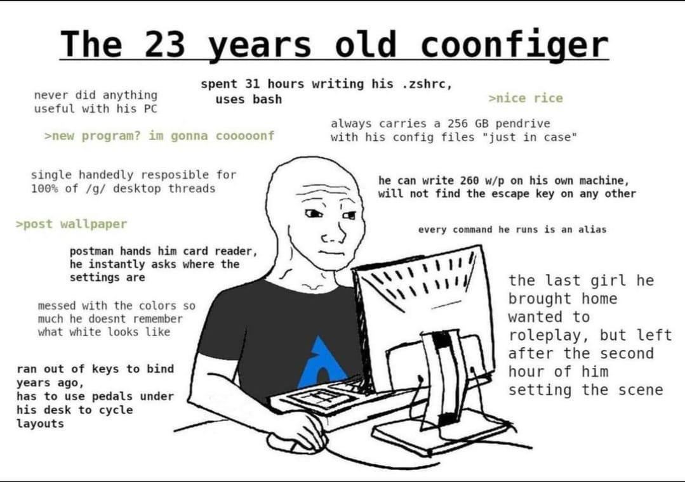

# BTW

- [Bootstrap a New Mac](#steps-to-bootstrap-a-new-mac)



## Steps to bootstrap a new Mac

1. Install Apple's Command Line Tools, which are prerequisites for Git and Homebrew.

```zsh
xcode-select --install
```

2. Install Homebrew, followed by the software listed in the Brewfile.

```zsh
# These could also be in an install script.

# Install Homebrew
/bin/bash -c "$(curl -fsSL https://raw.githubusercontent.com/Homebrew/install/HEAD/install.sh)"

# Then pass in the Brewfile location...
brew bundle --file ~/.dotfiles/Brewfile

# ...or move to the directory first.
cd ~/.dotfiles && brew bundle
```

3. Create `~/projects` folder

4. Generate SSH key and [add to GitHub](https://docs.github.com/en/authentication/connecting-to-github-with-ssh)

```zsh
ssh-keygen -t ed25519 -C ""
pbcopy < ~/.ssh/id_ed25519.pub
```

5. Clone repo into new hidden directory.

```zsh
# Use SSH (if set up)...
# and clone included nvim dir somehow...
git clone git@github.com:TikhonP/dotfiles.git

# ...or use HTTPS and switch remotes later.
git clone https://github.com/TikhonP/dotfiles.git
```

6. Create symlinks in the Home directory to the real files in the repo.

```zsh
mkdir ~/.config # so not all dot-config will not symlinked

stow --target=$HOME . --dotfiles
```

## Linux setup

TODO

## Some cool stuff

Firefox theme https://github.com/marmmaz/FirefoxCSS
https://github.com/Dook97/firefox-qutebrowser-userchrome

